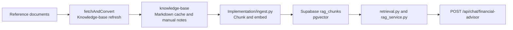

# FireBuddy

FireBuddy is a Singapore-focused personal finance and FIRE tracker. The current priority is the web app, with the Expo mobile app preserved for a later phase.

## Current Repo State

- `apps/web` is the active React and Vite frontend. It includes Supabase auth, dashboard, transactions, categories, profile, insights, accounts, add-expense modal, local fallback state, and backend sync for categories and expenses.
- `apps/backend` is the FastAPI backend. It currently mounts expense routes, category routes, and the financial advisor RAG endpoint.
- `apps/mobile` contains the earlier Expo and React Native implementation with tabs and add-expense work. It is not the current primary surface.
- `packages/shared` contains reusable TypeScript contracts, category data, add-expense helpers, and API route constants.
- `supabase` contains SQL migrations for profiles, categories, expenses, category visuals, and RAG pgvector storage.
- `docs` contains product, database, RAG, and Figma Make reference material.

## Start Here

- [PROJECT_BRIEF.md](PROJECT_BRIEF.md) for product direction, current architecture, and roadmap.
- [AGENTS.md](AGENTS.md) for repo workflow and agent guardrails.
- [docs/PRD.md](docs/PRD.md) for the current web product requirements.
- [supabase/README.md](supabase/README.md) for database setup order.

## Local Development

Run commands from the repo root unless a subproject README says otherwise.

```powershell
npm install
npm run dev:web
npm run dev:backend
```

Useful checks:

```powershell
npm run build:web
npm run lint:web
npm run lint:mobile
npm run typecheck:shared
```

The web app expects:

- `apps/web/.env.local` with `VITE_SUPABASE_URL`, `VITE_SUPABASE_PUBLISHABLE_KEY`, and `VITE_API_BASE_URL`
- `apps/backend/.env` with `SUPABASE_URL`, `SUPABASE_SECRET_KEY` or `SUPABASE_SERVICE_ROLE_KEY`, `SUPABASE_JWT_SECRET`, and optionally `OPENAI_API_KEY`

## Backend Routes

Mounted routes in `apps/backend/main.py`:

- `GET /categories`
- `POST /categories`
- `PUT /categories/{category_id}`
- `DELETE /categories/{category_id}`
- `GET /expenses`
- `POST /expenses`
- `PUT /expenses/{expense_id}`
- `DELETE /expenses/{expense_id}`
- `POST /api/chat/financial-advisor`

`apps/backend/routers/ai.py` contains a draft `POST /ai/parse-input` route, but it is not currently mounted in `main.py`.

## RAG Workspace

The RAG workspace under `apps/backend/rag/` supports the financial advisor endpoint.



Notes:

- `supabase/migrations/003_rag_pgvector.sql` creates `rag_chunks` and the `match_rag_chunks` RPC.
- `apps/backend/rag/Implementation/ingest.py` writes `text-embedding-3-small` embeddings to Supabase.
- `apps/backend/services/rag_service.py` handles advisor answers using retrieved context.
