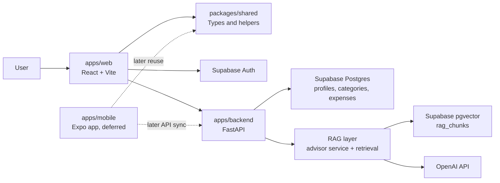
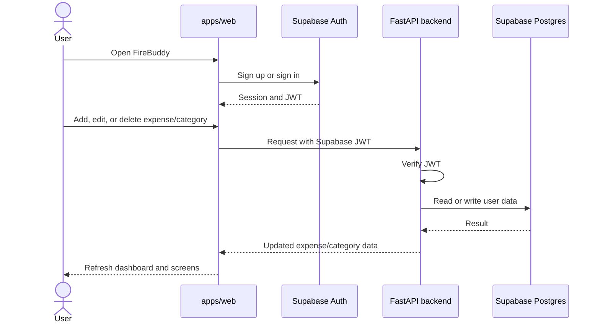
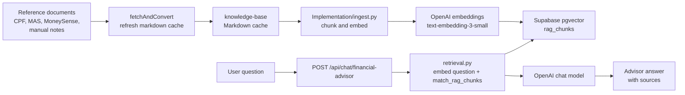
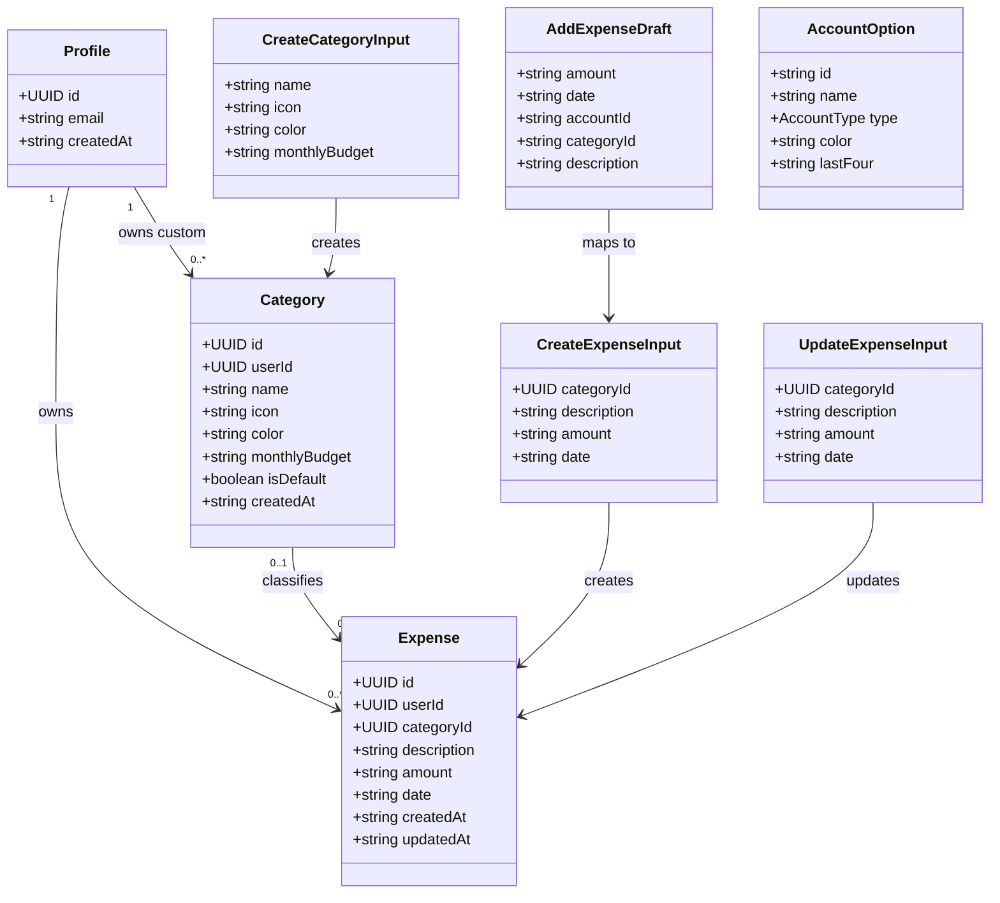
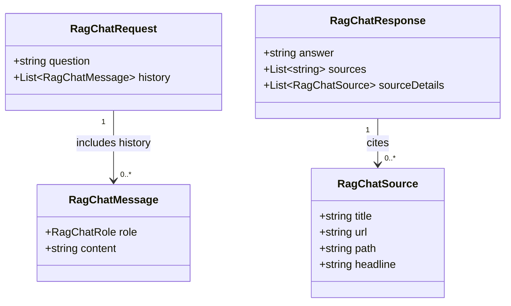
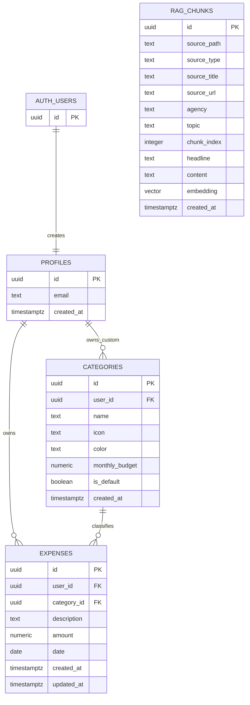

# FireBuddy

FireBuddy is a Singapore-focused personal finance and FIRE tracker. The current priority is the web app, with the Expo mobile app preserved for a later phase.

## Current Repo State

- `apps/web` is the active React and Vite frontend. It includes Supabase auth, dashboard, transactions, categories, profile, insights, accounts, add-expense modal, local fallback state, and backend sync for categories and expenses.
- `apps/backend` is the FastAPI backend. It currently mounts expense routes, category routes, and the financial advisor RAG endpoint.
- `apps/mobile` contains the earlier Expo and React Native implementation with tabs and add-expense work. It is not the current primary surface.
- `packages/shared` contains reusable TypeScript contracts, category data, add-expense helpers, and API route constants.
- `supabase` contains SQL migrations for profiles, categories, expenses, category visuals, and RAG pgvector storage.
- `docs` contains product, database, RAG, and Figma Make reference material.

## Start Here

- [PROJECT_BRIEF.md](PROJECT_BRIEF.md) for product direction, current architecture, and roadmap.
- [AGENTS.md](AGENTS.md) for repo workflow and agent guardrails.
- [docs/PRD.md](docs/PRD.md) for the current web product requirements.
- [supabase/README.md](supabase/README.md) for database setup order.

## Architecture Diagram



## App Workflow Diagram



## RAG Workflow Diagram



Workflow notes:

- The app workflow covers auth, expense CRUD, category CRUD, and screen refreshes.
- The RAG ingestion workflow is offline and separate from normal user actions.
- The advisor workflow reads from `rag_chunks` and does not write user expense data.

## Important Class Diagrams

Core app contracts from `packages/shared/src/types.ts`, `packages/shared/src/add-expense.ts`, and the matching FastAPI schema files:



RAG chat contracts from `packages/shared/src/types.ts` and `apps/backend/schemas/rag.py`:



Notes:

- `userId`, `categoryId`, source fields, and `lastFour` can be nullable depending on the contract.
- `CreateExpenseInput`, `UpdateExpenseInput`, and `CreateCategoryInput` mirror the FastAPI request schemas.
- `AddExpenseDraft` is UI state before validation and API submission.

## Database Architecture



Database notes:

- `profiles.id` references `auth.users.id`.
- `categories.user_id` is nullable so default system categories can coexist with user categories.
- `expenses.category_id` uses `on delete set null` so deleting a category does not delete historical expenses.
- `expenses.amount` is positive `numeric(10,2)`.
- `categories.monthly_budget` is nonnegative `numeric(10,2)`.
- `rag_chunks` is independent of user data and is searched through the `match_rag_chunks` RPC.

## Local Development

Run commands from the repo root unless a subproject README says otherwise.

```powershell
npm install
npm run dev:web
npm run dev:backend
```

Useful checks:

```powershell
npm run build:web
npm run lint:web
npm run lint:mobile
npm run typecheck:shared
python -m unittest discover apps/backend/tests
python -m py_compile apps/backend/services/rag_service.py apps/backend/rag/retrieval.py apps/backend/rag/Implementation/ingest.py apps/backend/rag/Implementation/answer.py apps/backend/rag/evaluation/report_history.py apps/backend/rag/evaluation/eval_retrieval.py apps/backend/rag/evaluation/eval_answers.py
```

The web app expects:

- `apps/web/.env.local` with `VITE_SUPABASE_URL`, `VITE_SUPABASE_PUBLISHABLE_KEY`, and `VITE_API_BASE_URL`
- Copy `apps/backend/.env.example` to `apps/backend/.env`, then configure `SUPABASE_URL`, `SUPABASE_SECRET_KEY` or `SUPABASE_SERVICE_ROLE_KEY`, `SUPABASE_JWT_SECRET`, and `OPENAI_API_KEY`.
- `RAG_MIN_SIMILARITY` is optional and defaults to `0.45`. The advisor refuses to answer when the top retrieved chunk is below this similarity threshold.
- `CORS_ALLOWED_ORIGINS` is a comma-separated production allowlist. Wildcard origins are rejected because authenticated requests use credentials.
- `ADVISOR_RATE_LIMIT_REQUESTS` and `ADVISOR_RATE_LIMIT_WINDOW_SECONDS` default to 10 requests per authenticated user per 60 seconds.

## Backend Routes

Mounted routes in `apps/backend/main.py`:

- `GET /categories`
- `POST /categories`
- `PUT /categories/{category_id}`
- `DELETE /categories/{category_id}`
- `GET /expenses`
- `POST /expenses`
- `PUT /expenses/{expense_id}`
- `DELETE /expenses/{expense_id}`
- `POST /api/chat/financial-advisor`

`apps/backend/routers/ai.py` contains a draft `POST /ai/parse-input` route, but it is not currently mounted in `main.py`.

## RAG Workspace

The RAG workspace under `apps/backend/rag/` supports the financial advisor endpoint.

Notes:

- `supabase/migrations/003_rag_pgvector.sql` creates `rag_chunks` and the `match_rag_chunks` RPC.
- `apps/backend/rag/Implementation/ingest.py` writes `text-embedding-3-small` embeddings to Supabase.
- `apps/backend/rag/Implementation/ingest.py` cleans stale `rag_chunks` rows after a successful full upsert. Use `--skip-cleanup` to disable cleanup. Cleanup is skipped automatically with `--limit`.
- `apps/backend/services/rag_service.py` handles advisor answers using retrieved context.
- `apps/backend/rag/evaluation/eval_retrieval.py` records document-level Hit@k, Precision@k, Recall@k, MAP@k, nDCG@k, and MRR.
- `apps/backend/rag/evaluation/eval_answers.py` checks grounded final answers, exact figures, citations, and out-of-scope refusals, with an optional structured LLM judge.
- `apps/backend/rag/evaluation/results/README.md` indexes every retained major test as Version 1, Version 2, and so on.
- `apps/backend/rag/evaluation/results/<suite>/versions/` stores immutable JSON and Markdown reports. The root `*_latest` files remain convenience copies only.

RAG commands:

```powershell
python apps/backend/rag/Implementation/ingest.py --dry-run
python apps/backend/rag/Implementation/ingest.py
python apps/backend/rag/Implementation/answer.py "What is CPF?"
python apps/backend/rag/evaluation/eval_retrieval.py
python apps/backend/rag/evaluation/eval_answers.py
```

Use `--run-label "Description"` to name a major run. Each saved run receives the next version number and never replaces an earlier version.

The live ingest and eval commands require `OPENAI_API_KEY`, `SUPABASE_URL`, and `SUPABASE_SECRET_KEY` or `SUPABASE_SERVICE_ROLE_KEY` in `apps/backend/.env`.

Latest live evaluation:

- Retrieval: Hit@1 `0.6000`, Hit@3 `0.9667`, Hit@5 `1.0000`, Recall@5 `0.8500`, nDCG@5 `0.7467`, and MRR `0.7861` across 30 questions.
- Answers: 12/12 cases passed, including six supported questions and six controlled refusals. Deterministic numeric accuracy was `1.0000`, citation recall was `0.9444`, and judge factual correctness was `1.0000`.

Current RAG V1 hardening intentionally does not include hybrid search, reranking, RAGAS, Langfuse, or a distributed rate-limit store.
