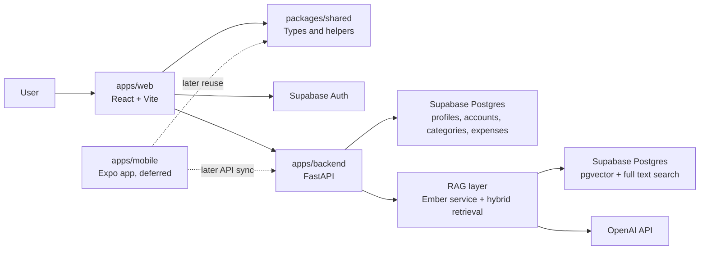
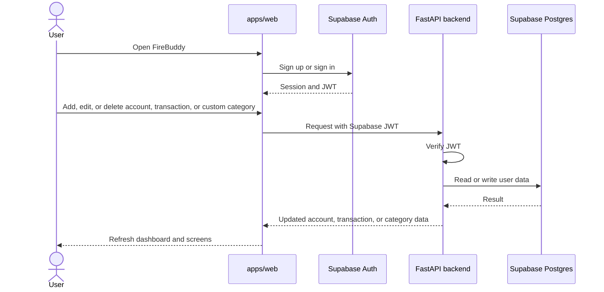
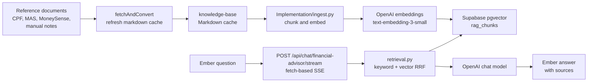
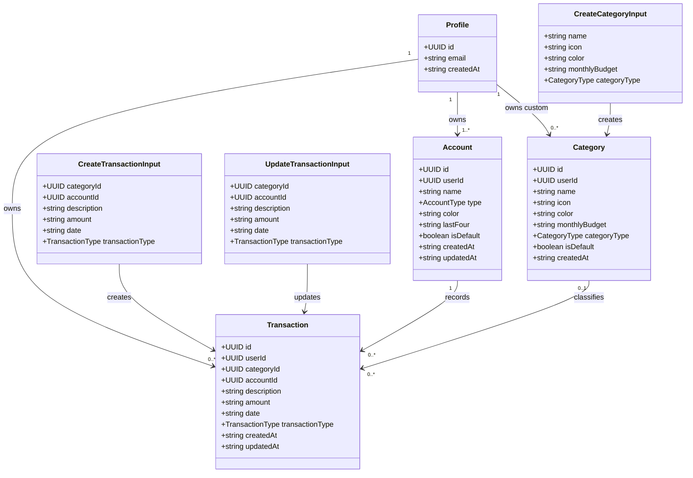
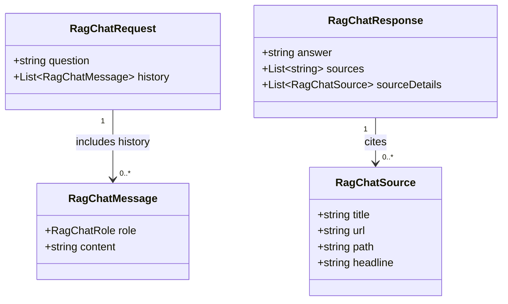
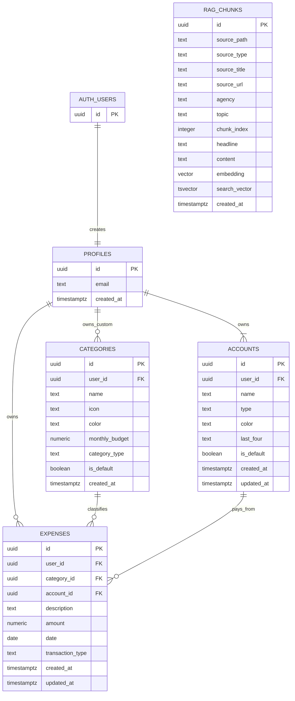

# FireBuddy

FireBuddy helps Singapore users understand their everyday finances and turn them into an explainable path toward financial independence. The current priority is the web app, with the Expo mobile app preserved for a later phase.

## Current Repo State

- `apps/web` is the active React and Vite frontend. Signed-in accounts, typed income and expense transactions, and custom categories synchronise through FastAPI. It also includes optional expense category suggestions, expense-only insights, a dashboard composed from current records, and Ember, a source-backed Singapore finance guide with browser-local topic history and streamed answers. App data uses local storage only in explicit demo mode.
- `apps/backend` is the FastAPI backend. It mounts health, account, transaction, compatibility expense, category, AI suggestion, and Ember JSON and SSE routes.
- `apps/mobile` contains the earlier Expo and React Native implementation with tabs and add-expense work. It is not the current primary surface.
- `packages/shared` contains reusable TypeScript contracts, category data, add-expense helpers, and API route constants.
- `supabase` contains timestamped SQL migrations for the UUID-aligned app schema, persisted accounts, typed transactions, security, HNSW indexing, and private hybrid RAG retrieval.
- `docs` contains product, database, RAG, and Figma Make reference material.

## Start Here

- [PROJECT_BRIEF.md](PROJECT_BRIEF.md) for current state, high-level product direction, architecture, and roadmap.
- [AGENTS.md](AGENTS.md) for repo workflow and agent guardrails.
- [docs/PRD.md](docs/PRD.md) for detailed product requirements, planned interfaces, and phased acceptance criteria.
- [supabase/README.md](supabase/README.md) for database setup and local CLI notes.

## Architecture Diagram



## App Workflow Diagram



## RAG Workflow Diagram



Workflow notes:

- The app workflow covers auth, account CRUD, typed income and expense transaction CRUD, custom category CRUD, and screen refreshes.
- The RAG ingestion workflow is offline and separate from normal user actions.
- Ember uses the private `hybrid_match_rag_chunks` RPC and does not inspect or write user account and transaction data.
- New Ember topics open with starter questions and an empty transcript. A starter fills the composer but never sends automatically.
- The user-facing guide currently covers CPF, CPFIS, Singapore Savings Bonds, MoneySense, IRAS reliefs, Singapore investing basics, and FIRE planning. The internal `financial-advisor` route name remains only for compatibility.
- Budgets beyond current category limits, goals, recurring tools, personal FIRE calculations, account inspection by Ember, and regulated advice remain later work.

## Important Class Diagrams

Primary app contracts from `packages/shared/src/types.ts` and the matching FastAPI schema files:



RAG chat contracts from `packages/shared/src/types.ts` and `apps/backend/schemas/rag.py`:



Notes:

- `userId`, `categoryId`, source fields, and `lastFour` can be nullable depending on the contract.
- `CreateTransactionInput`, `UpdateTransactionInput`, and `CreateCategoryInput` mirror the primary FastAPI request schemas.
- The shared `Expense` contracts and mounted `/expenses` routes remain for expense-only compatibility. New web CRUD uses the typed transaction contracts.

## Database Architecture



Database notes:

- `profiles.id` references `auth.users.id`.
- `categories.user_id` is nullable so default system categories can coexist with user categories.
- `categories.category_type` is either `expense` or `income`. Income categories have a zero budget.
- `expenses.category_id` uses `on delete set null` so deleting a category does not delete historical transactions.
- `expenses.account_id` is required and uses `on delete restrict` so referenced accounts cannot be removed.
- Every profile receives one default Cash account. Account names are unique per user and balances are intentionally out of scope.
- `expenses.transaction_type` distinguishes income from expenses without a disruptive table rename. Stored amounts remain positive `numeric(10,2)` and clients apply the display sign.
- `categories.monthly_budget` is nonnegative `numeric(10,2)`.
- `rag_chunks` is independent of user data and is searched through the private `hybrid_match_rag_chunks` RPC using full text and vector reciprocal rank fusion.
- Browser clients use Supabase for authentication only. FastAPI validates the bearer token, scopes user queries, and uses the backend-only secret or service-role key for application tables and RAG.

## Local Development

Run commands from the repo root unless a subproject README says otherwise.

```powershell
npm install
npm run dev:web
npm run dev:backend
```

Useful checks:

```powershell
npm run build:web
npm run lint:web
npm run lint:mobile
npm run typecheck:mobile
npm run typecheck:shared
npm run test:web
python -m unittest discover apps/backend/tests -v
python -m py_compile apps/backend/services/ember_planner.py apps/backend/services/ember_data_tools.py apps/backend/services/ember_service.py apps/backend/services/rag_service.py apps/backend/rag/retrieval.py
```

The web app expects:

- `apps/web/.env.local` with `VITE_SUPABASE_URL`, `VITE_SUPABASE_PUBLISHABLE_KEY`, and `VITE_API_BASE_URL`
- Copy `apps/backend/.env.example` to `apps/backend/.env`, then configure `SUPABASE_URL`, `SUPABASE_SECRET_KEY` or `SUPABASE_SERVICE_ROLE_KEY`, `SUPABASE_JWT_SECRET`, and `OPENAI_API_KEY`.
- `RAG_MIN_SIMILARITY` is optional and defaults to `0.45`. Ember refuses to answer when the top retrieved chunk is below this similarity threshold.
- `EMBER_PLANNER_MODEL` is optional and defaults to `gpt-4o-mini`. It must support Structured Outputs.
- `CORS_ALLOWED_ORIGINS` is a comma-separated production allowlist. Wildcard origins are rejected because authenticated requests use credentials.
- `ADVISOR_RATE_LIMIT_REQUESTS` and `ADVISOR_RATE_LIMIT_WINDOW_SECONDS` default to 10 requests per authenticated user per 60 seconds.
- `AI_SUGGESTION_RATE_LIMIT_REQUESTS` and `AI_SUGGESTION_RATE_LIMIT_WINDOW_SECONDS` independently default to 10 requests per authenticated user per 60 seconds.

## Backend Routes

Mounted routes in `apps/backend/main.py`:

- `GET /`
- `GET /health`
- `GET /accounts`
- `POST /accounts`
- `PUT /accounts/{account_id}`
- `DELETE /accounts/{account_id}`
- `GET /categories`
- `POST /categories`
- `PUT /categories/{category_id}`
- `DELETE /categories/{category_id}`
- `GET /expenses`
- `POST /expenses`
- `PUT /expenses/{expense_id}`
- `DELETE /expenses/{expense_id}`
- `GET /transactions`
- `POST /transactions`
- `PUT /transactions/{transaction_id}`
- `DELETE /transactions/{transaction_id}`
- `POST /ai/parse-input`
- `POST /api/chat/financial-advisor`
- `POST /api/chat/financial-advisor/stream`

All application data routes and AI routes require a Supabase bearer token. Only `/`, `/health`, and CORS preflight requests are public.

`/transactions` is the primary typed income and expense API. `/expenses` remains mounted for the current expense-only compatibility period. Ember uses the authenticated SSE route for status and answer streaming. The JSON route remains unchanged for compatibility.

## Deployment

The repository includes production configuration but does not deploy without account authorisation:

- `vercel.json` builds the root monorepo with `npm run build:web`, serves `apps/web/dist`, and rewrites SPA deep links to `index.html`.
- `apps/backend/railway.toml` uses Railpack, Python 3.11, Uvicorn, `/health`, restart-on-failure, and one Singapore replica.
- Deploy Railway first. Configure its Supabase, OpenAI, JWT, CORS, advisor-limit, and AI-suggestion-limit variables.
- Set the Railway public URL as `VITE_API_BASE_URL` in Vercel, then deploy Vercel and tighten `CORS_ALLOWED_ORIGINS` to the production URL and required preview origins.
- Hosting plans and pricing can change, so confirm the current [Vercel plans](https://vercel.com/docs/plans) and [Railway pricing](https://docs.railway.com/pricing) before deployment.

### Cost estimate

This planning estimate is for the maintainer's reference. It was checked on 4 September 2026, uses USD, and excludes taxes, a custom domain, email delivery, monitoring add-ons, and usage above included plan allowances.

Current model prices used in the estimate:

| Model | Input per 1M tokens | Cached input per 1M tokens | Output per 1M tokens |
|---|---:|---:|---:|
| [GPT-4o mini](https://developers.openai.com/api/docs/models/gpt-4o-mini) | $0.15 | $0.075 | $0.60 |
| [text-embedding-3-small](https://developers.openai.com/api/docs/models/text-embedding-3-small) | $0.02 | Not applicable | Not applicable |

Approximate Ember cost per question, based on typical short questions, bounded history, and concise answers:

| Question path | Calls | Approximate cost |
|---|---|---:|
| Simple personal total | One planner call, one deterministic data tool | $0.00014 |
| Explained personal result | One planner call, one data tool, one answer call | $0.00047 |
| Curated knowledge answer | One planner call, one embedding, one answer call | $0.00084 |
| Personal result plus curated guidance | One planner call, one data tool, one embedding, one answer call | $0.00095 |

The data tool is ordinary backend and database computation, so it has no separate AI fee. Simple totals return deterministic text without a second answer generation call. Explained, knowledge, and hybrid questions send the trusted tool result or retrieved context back to the answer model. Actual cost depends on prompt length, retrieved context, output length, retries, and traffic.

Practical monthly AI allowance:

| Ember questions per month | Suggested OpenAI allowance |
|---:|---:|
| 2,000 | $2 to $5 |
| 10,000 | $15 to $30 |
| 30,000 | $25 to $60 |
| 100,000 | $150 to $300 |

Approximate platform totals:

| Deployment shape | Supabase | Railway | Vercel | OpenAI | Approximate total |
|---|---:|---:|---:|---:|---:|
| Portfolio or small beta | $25 Pro | $5 Hobby minimum | $0 Hobby for eligible personal use | $2 to $5 | $32 to $35 per month |
| Small production setup | $25 Pro | $20 Pro minimum | $20 Pro | $2 to $10 | $67 to $75 per month |

Pricing references: [Supabase Pro starts at $25](https://supabase.com/pricing), [Railway Hobby is $5 and Pro is $20 with matching included usage](https://docs.railway.com/pricing/plans), and [Vercel Hobby is $0 while Pro starts at $20](https://vercel.com/pricing). Vercel Hobby is intended for personal, non-commercial use. Recheck all prices before deployment.

## RAG Workspace

The RAG workspace under `apps/backend/rag/` supports Ember's curated knowledge path. The same streaming endpoint now routes personal questions to fixed read-only data tools and can combine their aggregate results with RAG context, while retaining the JSON compatibility endpoint.

Notes:

- `supabase/migrations/20260702161557_rag_pgvector.sql` creates `rag_chunks` and the original vector retrieval RPC.
- `supabase/migrations/20260814051717_replace_rag_ivfflat_with_hnsw.sql` replaces the earlier IVFFlat index with HNSW.
- `supabase/migrations/20260814052904_add_private_hybrid_rag_retrieval.sql` adds weighted full text search and the private `hybrid_match_rag_chunks` RRF RPC.
- `apps/backend/rag/Implementation/ingest.py` writes `text-embedding-3-small` embeddings to Supabase.
- `apps/backend/rag/Implementation/ingest.py` cleans stale `rag_chunks` rows after a successful full upsert. Use `--skip-cleanup` to disable cleanup. Cleanup is skipped automatically with `--limit`.
- `apps/backend/services/rag_service.py` handles Ember answers using retrieved context.
- `apps/backend/rag/evaluation/eval_retrieval.py` records document-level Hit@k, Precision@k, Recall@k, MAP@k, nDCG@k, and MRR.
- `apps/backend/rag/evaluation/eval_answers.py` checks grounded final answers, exact figures, citations, and out-of-scope refusals, with an optional structured LLM judge.
- `apps/backend/rag/evaluation/results/README.md` indexes every retained major test as Version 1, Version 2, and so on.
- `apps/backend/rag/evaluation/results/<suite>/versions/` stores immutable JSON and Markdown reports. The root `*_latest` files remain convenience copies only.

RAG commands:

```powershell
python apps/backend/rag/Implementation/ingest.py --dry-run
python apps/backend/rag/Implementation/ingest.py
python apps/backend/rag/Implementation/answer.py "What is CPF?"
python apps/backend/rag/evaluation/eval_retrieval.py
python apps/backend/rag/evaluation/eval_answers.py
```

Use `--run-label "Description"` to name a major run. Each saved run receives the next version number and never replaces an earlier version.

The live ingest and eval commands require `OPENAI_API_KEY`, `SUPABASE_URL`, and `SUPABASE_SECRET_KEY` or `SUPABASE_SERVICE_ROLE_KEY` in `apps/backend/.env`.

Latest live evaluation:

- Retrieval Version 2, after HNSW and hybrid RRF: Hit@1 `0.7667`, Hit@3 `0.9667`, Hit@5 `1.0000`, Recall@5 `0.9167`, nDCG@5 `0.8353`, and MRR `0.8622` across 30 questions.
- Answers: 12/12 cases passed, including six supported questions and six controlled refusals. Deterministic numeric accuracy was `1.0000`, citation recall was `0.9444`, and judge factual correctness was `1.0000`.

Current RAG hardening does not yet include a separate reranker, RAGAS, Langfuse, or a distributed rate-limit store.
