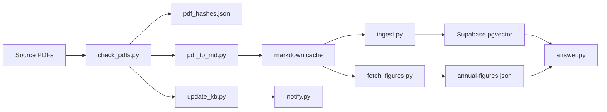

# fireBuddy

Singapore-focused personal finance and FIRE tracker.

The repo uses a minimal monorepo shape:
- `apps/mobile` contains the current Expo implementation
- `apps/web` contains the web-first Vite scaffold
- `apps/backend` contains the FastAPI scaffold
- `packages/shared` contains shared contracts
- `docs/Figmamake` contains design reference material

Start here:
- [PROJECT_BRIEF.md](PROJECT_BRIEF.md) for product and architecture direction
- [AGENTS.md](AGENTS.md) for repo workflow and agent guardrails

Local development:
- Run the web app from the repo root with `npm run dev:web`

Reference:
- Figma site: https://malt-pride-11376584.figma.site/categories

## RAG Map

The current RAG workspace under `apps/backend/rag/` is split into two parts:

- `fetchAndConvert/` handles knowledge-base updates
- `Implementation/` holds the embedding and answer-side RAG logic

Notes:
- `update_kb.py` currently orchestrates PDF checks, optional markdown conversion, optional figure extraction, and optional notifications.
- `ingest.py` is the embedding step, but the current orchestrator says ingestion is still skipped.
- `annual-figures.json` is kept separate from the vector store because those values need to stay exact.
