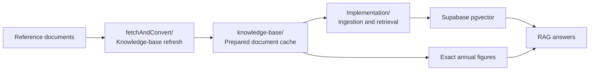

# fireBuddy

Singapore-focused personal finance and FIRE tracker.

The repo uses a minimal monorepo shape:
- `apps/mobile` contains the current Expo implementation
- `apps/web` contains the web-first Vite scaffold
- `apps/backend` contains the FastAPI scaffold
- `packages/shared` contains shared contracts
- `docs/Figmamake` contains design reference material

Start here:
- [PROJECT_BRIEF.md](PROJECT_BRIEF.md) for product and architecture direction
- [AGENTS.md](AGENTS.md) for repo workflow and agent guardrails

Local development:
- Run the web app from the repo root with `npm run dev:web`

Reference:
- Figma site: https://malt-pride-11376584.figma.site/categories

## RAG Map

The current RAG workspace under `apps/backend/rag/` is split into two main areas:

- `fetchAndConvert/` prepares and refreshes the knowledge base
- `Implementation/` handles ingestion, retrieval, and answer generation

Notes:
- The refresh area checks source documents, prepares cached content, and can update exact annual figures.
- The implementation area turns prepared content into embeddings and retrieves relevant context for answers.
- Exact annual figures stay separate from the vector store because those values must remain precise.
