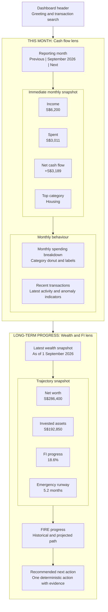
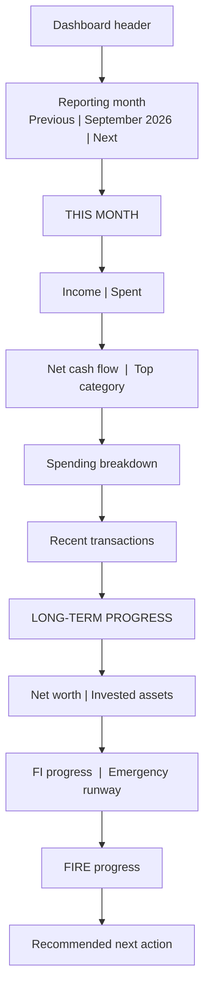

# Dashboard Two-Lens Wireframe

Status: Draft for design review before implementation.

The dashboard is divided into two clear questions:

1. **How am I living right now?** Monthly income, spending, and transaction behaviour.
2. **Am I getting closer to my goal?** Wealth position and progress toward financial independence.

The user-facing section names below are working labels. The two-lens structure is the important decision.

## Desktop layout

## Mobile reading order

## Time and interaction rules

| Area | Time scope | Behaviour |
| --- | --- | --- |
| Income, Spent, Net cash flow, Top category | Selected reporting month | All four update when the month changes |
| Spending breakdown | Selected reporting month | Uses the same month as the cash flow metrics |
| Recent transactions | Selected reporting month | Shows the latest transactions within that month |
| Net worth, Invested assets, FI progress, Emergency runway | Latest available snapshot | Does not change with the reporting month |
| FIRE progress and recommended action | Latest available financial summary | Keeps its evidence date visible |

## Layout intent

- Use compact metric cards with reduced padding, four columns on desktop and two columns on mobile.
- Keep the reporting month inside the cash flow section because it does not control wealth metrics.
- Replace Savings rate with Net cash flow so the result is expressed as an immediate dollar amount.
- Keep Emergency runway, but place it in the long-term section instead of the first dashboard row.
- Preserve one recommended action and keep its evidence and destination explicit.
